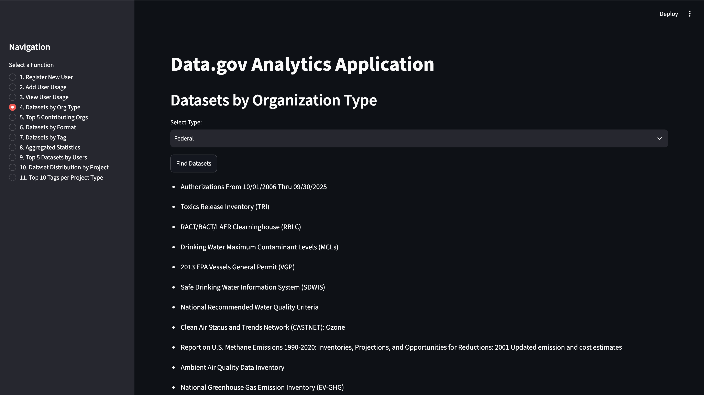

# DataGov-Extractor

An end-to-end data pipeline that collects dataset metadata from
[catalog.data.gov](https://catalog.data.gov), stores it in a normalized MySQL
database, and serves an interactive analytics dashboard with Streamlit.

<!-- Add a screenshot of the running dashboard as docs/dashboard.png, then uncomment:

-->

## What it does

1. **Collects** — `main_crawler.py` walks 100 catalog pages with `requests` +
   `BeautifulSoup`, extracting ~2,000 datasets: identifier, publisher,
   maintainer, license, access level, created/updated dates, topic, tags, and
   every downloadable file (format + URL). Dates are normalised to ISO format
   before insert.
2. **Stores** — `database_handler.py` writes to MySQL with duplicate protection
   (lookup-before-insert for organisations, `INSERT IGNORE` for files and tags).
   Seven normalised tables: `Organization`, `Project`, `Dataset`, `Files`,
   `Tags`, `AppUser`, `UsageRecord`.
3. **Serves** — `app.py` is a Streamlit app with 11 functions, including user
   registration and usage logging, filtering by organisation type / format /
   tag, and multi-join aggregates (top-5 contributing organisations, most-used
   datasets, top-10 tags per project type).

## Stack

Python 3 · requests · BeautifulSoup4 · MySQL (mysql-connector-python) · Streamlit
(originally deployed against TiDB Serverless; runs on local MySQL as below)

## Run it locally

Requires Python 3 and a MySQL server. On macOS: `brew install mysql && brew services start mysql`
(a fresh Homebrew install has no root password — press Enter at the prompts).

```bash
git clone https://github.com/KarimNashed/DataGov-Extractor.git
cd DataGov-Extractor

python3 -m venv venv && source venv/bin/activate   # Windows: venv\Scripts\activate
pip install streamlit mysql-connector-python requests beautifulsoup4

# 1) create the database and load the schema + sample data
mysql -u root -p -e "CREATE DATABASE IF NOT EXISTS DBSProject;"
mysql -u root -p DBSProject < Database/Karim_Nashed_DB_Dump.sql

# 2) add your DB credentials (see below), then
streamlit run app.py
```

Create `.streamlit/secrets.toml` in the project root (it is git-ignored):

```toml
[database]
host = "localhost"
port = 3306
user = "root"
password = ""          # your MySQL root password, if you set one
database = "DBSProject"
ssl_ca = ""            # only needed for a hosted DB such as TiDB Cloud
```

To re-collect from Data.gov instead of using the dump: `python main_crawler.py`
(≈100 pages; the script sleeps between requests to stay polite).

## Repo layout

```
main_crawler.py       collection + parsing
database_handler.py   MySQL inserts with dedup
app.py                Streamlit dashboard (11 views)
Database/             schema + data dump (sample export, ~5 MB)
Data/                 CSV exports of each table
```

## Notes

Built for the Database Systems course at AUC (Spring 2026). Solo project.
